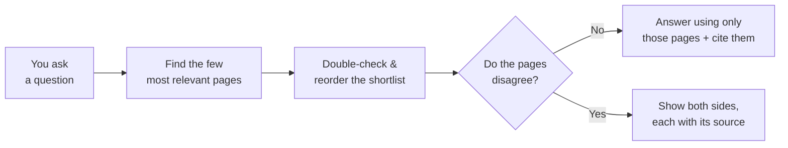
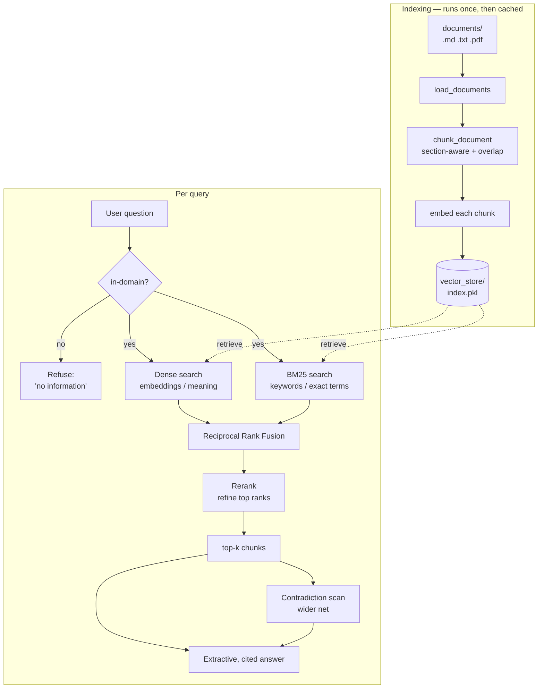
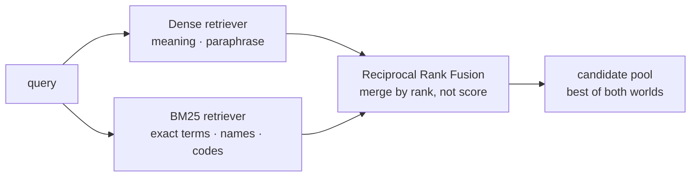
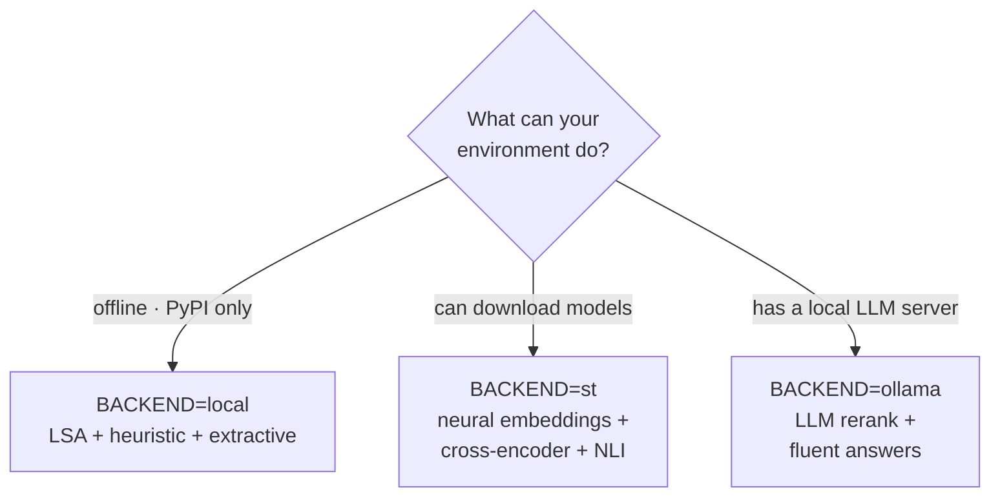

# The Mini RAG Chatbot — Explained

*One document, two lenses: a plain-English explanation anyone can follow, then
the full technical breakdown. Everything here describes what the code in this
folder actually does.*

---

# Part 1 — The non-technical version

## What is this, in one sentence?

It's a small question-answering assistant that only answers using a specific set
of documents you give it, always tells you which document each answer came from,
and warns you when two documents disagree.

## The problem it solves

A normal chatbot answers from memory. That memory is frozen at training time, it
doesn't know about *your* private files, and it will happily make things up
("hallucinate") with total confidence. If you ask about your company's PTO policy,
a generic chatbot has no idea — and might invent an answer.

This project fixes that by making the assistant **open-book instead of
closed-book**. Before it answers, it looks things up in your documents, and it may
only answer from what it finds.

## The librarian analogy

Imagine a librarian answering your question:

1. **You ask a question.** ("How many vacation days do I get?")
2. **The librarian finds the right pages.** They don't read the whole library —
   they pull the few pages most likely to contain the answer.
3. **They double-check which pages are actually best.** A quick second look to
   reorder the shortlist so the most relevant page is on top.
4. **They answer using only those pages** and point at the exact source: "Page 4
   of the 2023 handbook says 15 days."
5. **If two pages disagree, they say so** instead of silently picking one: "Careful
   — the 2023 handbook says 15 days, but the 2024 handbook says 20."

That five-step routine is exactly what this project automates:



## The three things that make it trustworthy

- **It cites its sources.** Every claim points at the document it came from, so you
  can verify it. An answer with no source is a red flag.
- **It admits when it doesn't know.** If your question isn't covered by the
  documents (e.g. "what's the weather on Mars?"), it says *"I don't have
  information about that"* instead of bluffing.
- **It surfaces contradictions.** When documents from different years or authors
  disagree, it shows both sides rather than hiding the conflict.

## Why "disagreeing documents" is a big deal

Most search tools just return whatever ranks highest and move on. But real
knowledge bases are messy: an old policy and a new policy, two teams with
different numbers, a spec that changed. Silently trusting one and ignoring the
other is how wrong answers happen. This assistant is built to *notice* the
conflict and hand you both sides with their sources — so you make the call.

## How we know it actually works

We didn't just eyeball it. There's a built-in "exam" (an evaluation harness): a
list of questions with known correct sources. The system is graded automatically
on how often it finds the right documents and how often it correctly flags
contradictions. That way, any change can be *proven* to help or hurt, instead of
guessed. On the sample documents it scores a perfect record on contradiction
detection (catches every real conflict, never raises a false alarm).

## A note on honesty

This assistant runs entirely on your own machine with no internet, no paid AI
service, and no data leaving your computer. That's a deliberate constraint, and it
has an honest trade-off: without a large AI model, the answers are stitched
together from the actual sentences in your documents (accurate and verifiable, but
not as smooth as a chatbot that writes fresh prose). The project is built so you
can plug in a more powerful AI model later for smoother answers — without changing
anything else.

---

# Part 2 — The technical version

## What it is

A from-scratch Retrieval-Augmented Generation (RAG) system in ~700 lines of
Python, with **no LangChain, no vector-database server, and no mandatory cloud
API**. It implements the parts that actually determine RAG quality — chunking,
hybrid retrieval, fusion, reranking, contradiction handling — plus an evaluation
harness that measures them.

It runs in three files:

| File | Role |
|------|------|
| `rag.py` | the whole engine (load → chunk → embed → retrieve → rerank → answer) |
| `app.py` | interactive command-line chatbot |
| `eval.py` | evaluation harness (retrieval + contradiction metrics) |

Plus `documents/` (the knowledge base), `evalset.jsonl` (labelled test questions),
and `.env` (configuration).

## The pipeline, end to end



<details>
<summary>Same pipeline as plain-text ASCII (fallback if Mermaid doesn't render)</summary>

```
                          ┌─────────────── indexing (once) ───────────────┐
 documents/*.md,.txt,.pdf → load → structure-aware chunking → embed each chunk
                                                                   │
                                                          persisted index
                                                          (vector_store/index.pkl)
                          └────────────────────────────────────────────────┘

                          ┌──────────────── per query ─────────────────────┐
 user question → out-of-domain check → dense search ┐
                                     → BM25  search  ┼─ Reciprocal Rank Fusion
                                                     ┘          │
                                                        candidate pool
                                                             │
                                                          reranking
                                                             │
                                                        top-k chunks
                                                             │
                              contradiction scan ← ─ ─ ─ ─ ─ ─┤ (wider net)
                                                             │
                                            extractive, source-cited answer
                          └────────────────────────────────────────────────┘
```

</details>

### 1. Loading (`load_documents`)
Reads every `.md`, `.txt`, and `.pdf` in `documents/`. PDFs are parsed with
`pypdf`. Each file becomes `{source, text}`.

### 2. Chunking strategy (`chunk_document`)
Documents are too large to embed whole and too coarse to retrieve precisely, so
they are split into chunks:
- **Section-aware first:** split on Markdown headers so a chunk never mixes two
  unrelated sections.
- **Recursive next:** within a section, split on paragraph → line → sentence →
  word boundaries until each piece fits `CHUNK_SIZE` characters.
- **Overlap:** a `CHUNK_OVERLAP`-character tail of the previous chunk is prepended
  (trimmed to a word boundary) so context spanning a boundary isn't lost.
Each chunk keeps `{source, section, text}` for citation.

### 3. Two retrievers (complementary by design)
- **Dense retrieval** (`dense_search`): embed the query and every chunk into
  vectors; rank by cosine similarity. Captures **meaning** — matches paraphrases
  and synonyms.
- **Sparse retrieval / BM25** (`BM25`, from scratch): a term-frequency /
  inverse-document-frequency ranking with length normalization. Captures **exact
  terms** — names, codes, rare words. No model needed.

They have opposite blind spots: dense misses exact identifiers, BM25 misses
paraphrases. That's why we use both, then fuse:



### 4. Hybrid fusion (`reciprocal_rank_fusion`)
Dense cosine scores and BM25 scores live on different, incomparable scales, so we
don't add them. Instead, **Reciprocal Rank Fusion** combines the two ranked lists
using only *rank*: each item scores `1 / (RRF_K + rank)` summed across the lists
it appears in. Items ranked highly by both retrievers rise to the top.

### 5. Reranking (`FeatureReranker` / `CrossEncoderReranker` / `LLMReranker`)
A second pass over the fused candidate pool to sharpen top-rank precision (what
matters, since only a few chunks reach the answer step). The offline reranker
re-scores candidates with semantic similarity + query-term coverage **while
keeping the fusion order as a prior**, so it refines rather than discards the
first stage.

### 6. Answer generation (`ExtractiveAnswerer` / `LLMAnswerer`)
The offline answerer is **extractive**: it selects the most relevant sentences
from the top chunks and presents them with inline `[n]` citations. Sentence
selection combines similarity with the chunk's rank (trust the reranker) and, for
"what is X" questions, a **definition boost** that prefers the sentence where the
query term is the subject ("*RAG is a technique…*"). Near-duplicate sentences and
mid-word overlap fragments are filtered out.

### 7. Contradiction handling (`ContradictionDetector`)
After retrieval, the system takes the single most query-relevant sentence from
each distinct source (over a **wider net** than it cites, so both sides of a
conflict are present) and compares them pairwise. A conflict is flagged when two
statements about the same thing disagree on a **quantity** (digits or spelled-out
numbers — "three" vs "five") or on **polarity** ("offered" vs "no longer offered",
only when the sentences are otherwise near-identical). Off-topic sources are
excluded by a query-relevance gate so unrelated sentences can't raise false
alarms.

### 8. Out-of-domain refusal (`RAG._out_of_domain`)
Before answering, the system checks whether any of the query's content words
appear in the corpus at all. If none do (e.g. "who won the world cup?"), it refuses
with *"I don't have information about that"* instead of forcing an answer from
loosely-matching chunks. (This gate is used on the offline backend, where the weak
embedder can otherwise be fooled by dropped out-of-vocabulary words.)

## The three backends (same pipeline, swappable models)

Set `BACKEND` in `.env`:

| Backend | Embeddings | Rerank | Contradiction | Answer | Requirements |
|---------|-----------|--------|---------------|--------|--------------|
| `local` *(default)* | **LSA** (TF-IDF + truncated SVD, from scratch) | feature reranker | numeric/negation heuristic | extractive + citations | **numpy only — fully offline** |
| `st` | sentence-transformers bi-encoder | cross-encoder | NLI cross-encoder | extractive + citations | HuggingFace model downloads |
| `ollama` | Ollama embeddings | listwise LLM | LLM judgement | LLM-generated prose | a local Ollama server |

The `local` backend was chosen as the default because this project targets a
locked-down machine where only PyPI is reachable (no model downloads, no API
keys). `st` and `ollama` are drop-in upgrades when the network or hardware allows.



## The evaluation harness (`eval.py`)

Retrieval is graded against `evalset.jsonl`, where each question is labelled with
the documents that *should* be retrieved:

- **Hit@1** — is the first retrieved document relevant? (sensitive to ranking)
- **Recall@k** — how many relevant documents appear in the top *k*?
- **MRR** — Mean Reciprocal Rank; rewards ranking the first relevant doc high.
- **nDCG@k** — rewards ranking *all* relevant docs high, discounted by position.

Contradiction handling is graded as a classifier: **precision** and **recall** over
questions labelled `expected_contradiction`, with non-conflicting questions
(including deliberately identical policies) as negative controls.

Run:
```bash
python eval.py               # retrieval metrics for all four modes
python eval.py --contradict  # also score contradiction detection
```

## Honest engineering findings

The harness isn't decoration — it produced real, non-obvious results:

- **On this small corpus, all four retrievers tie.** With ~36 chunks, the LSA
  embedder keeps ~35 latent dimensions (near full rank), so "dense" collapses into
  lexical cosine and ranks almost identically to BM25. **Offline LSA cannot beat
  BM25 on a corpus this small, by construction** — a genuine dense advantage needs
  a larger corpus or a pretrained embedding model (`BACKEND=st`). The harness
  *proves* this instead of hand-waving.
- **It caught three regressions during development:** a reranker that discarded the
  fusion signal (fixed with a fusion prior), a contradiction scanner that flagged
  off-topic sources (fixed with a query-relevance gate), and a heuristic that fired
  on a stray "not" and missed spelled-out numbers (fixed).
- **Contradiction detection is exact on the sample data:** precision 1.0, recall
  1.0 across nine conflicts (PTO, remote work, hours, probation, bonus,
  reimbursement — including paraphrased questions) and nine negative controls.

## Design decisions & trade-offs

- **From scratch, not LangChain** — the goal was to understand and control the hard
  parts (chunking, fusion, reranking), not to wire together abstractions.
- **Brute-force vectors, not a vector DB** — for a mini corpus, NumPy cosine over a
  persisted matrix is simpler and has zero dependencies. A real deployment would
  swap in a vector store; the interface is small.
- **Extractive answers offline** — faithful and verifiable, but not fluent.
  Fluent synthesis needs an LLM (`BACKEND=ollama`). The trade-off is explicit.
- **Heuristic contradiction detection offline** — robust for quantity/polarity
  conflicts; genuine semantic contradiction needs an NLI model (`BACKEND=st`).

## Configuration knobs (`.env`)

| Key | Meaning |
|-----|---------|
| `BACKEND` | `local` / `st` / `ollama` |
| `CHUNK_SIZE`, `CHUNK_OVERLAP` | chunking granularity |
| `TOP_K` | chunks used to answer |
| `POOL` | candidates each retriever contributes before fusion/rerank |
| `RRF_K` | Reciprocal Rank Fusion smoothing constant |
| `RERANK` | enable/disable reranking |
| `LSA_DIM` | latent dimensions for the offline embedder |
| `CONTRADICTION_MIN_RATIO` | how relevant a source must be to enter conflict comparison |

## Glossary

- **RAG** — Retrieval-Augmented Generation: ground answers in retrieved documents.
- **Embedding** — a vector representing a text's meaning; similar meanings → nearby vectors.
- **Chunk** — a small, coherent slice of a document, the unit of retrieval.
- **BM25** — a classic keyword ranking function (term frequency × inverse document frequency).
- **Dense / sparse retrieval** — meaning-based (embeddings) vs keyword-based (BM25).
- **RRF** — Reciprocal Rank Fusion: merge ranked lists by position, not score.
- **Reranking** — a precise second-pass reordering of a small candidate shortlist.
- **NLI** — Natural Language Inference: decides if one statement entails/contradicts another.
- **Recall@k / MRR / nDCG** — standard retrieval quality metrics.
